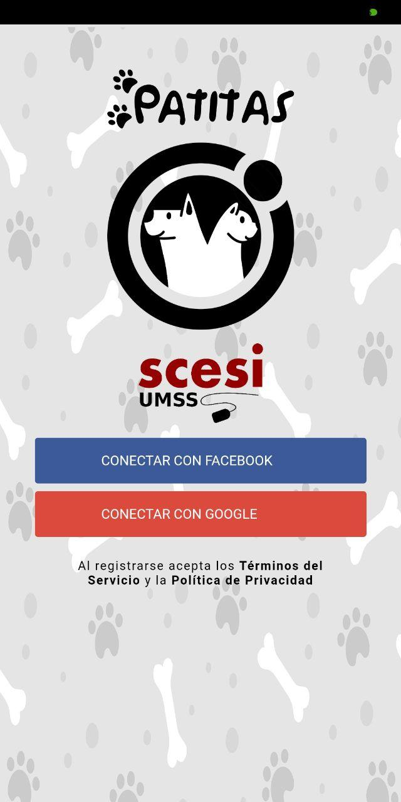
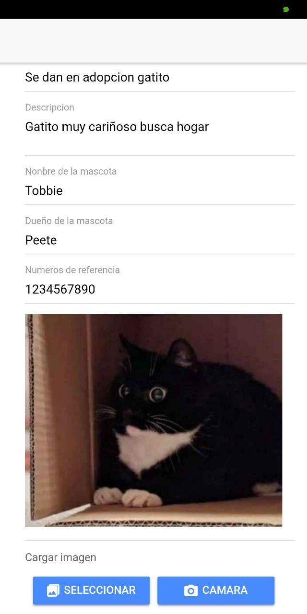
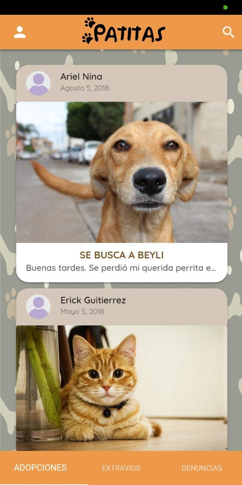
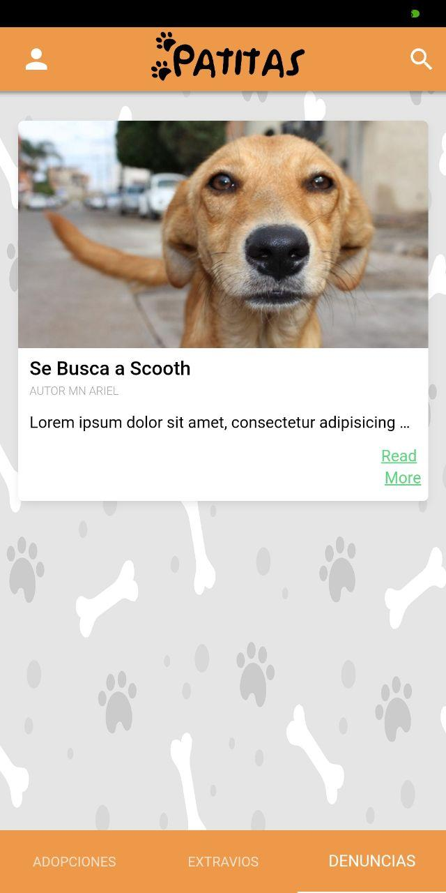

# Abdiel Orellana S.
 
> Hola gracias por visitar mi perfil, en este tratare de mostrar todos los proyectos que realize y valla realizando con una descripcion de los mismos, algunos posts de temas que me gustaron y quise compartirlos.

> Disculpa si en ocaciones lees palabras que deberian ir con **ñ** o acentuadas, al usar una distribucion de teclado en ingles y el S.O. GNU/Linux se complica, asi que sera comun, tratare que sea lo menos posible, que veas palabras como: `"anio"` y sin acentos XD, etc.

## Posts

> Recien comenzare a publicar algunos posts por lo que de momento no hay nada o muy poco, paciencia.

***
## Proyectos
> No todos los proyectos se encuentran en GitHub, una gran mayoria estan en **GitLab** y en su mayoria entan como poryectos privados 

* **MEOW - "Patitas":** Fue un proyecto realizado con unos amigos que se presentaria en en evento de **CCBOL Pando - Bolivia 2018**, en el cual logramos en el primer lugar.
	La aplicacion tenia una similitud a una red social enfocado a la adopcion de mascotas, tambien en la ayuda entre la comunidad se puedan dar avisos de extravios de mascotas.

 |  |  | 
--- | --- | --- | ---

* **Emerbag.** Surgio como una propuesta de solucion para.. que se presento en una **Hackathon de NASA Space Apps Cochabamba - Bolivia 2018**  

***

### Proyectos Personales

* **Tic Tac Toe**
  Tambien conocido como 3 en raya, el reto de este proyecto era implemetar el juego en un lenguage de programacion fuertemente tipado, en este caso escogi **Java**, no se debia implementar una interfaz grafica, y se debia respetar las 12 reglas de [Object Calisthenics](https://keyvanakbary.com/object-calisthenics-mejora-tu-diseno-orientado-a-objetos/), fue un reto interesante y supuso un reto al implemetar una solucion usando POO y respetar las reglas de Calistenia de Objetos

* **Busca minas**
  Se debia implementar una solucion usando los **principios SOLID** junto con una interfaz grafica y un lenguaje de programacion fuetemente tipado, escogi **Java** este proyecto *aun no cuenta con interfaz gradica*.
  referencias\:
    * [Guide to SOLID Principles](https://www.baeldung.com/solid-principles)
    * [Principios SOLID POO](https://desarrollowp.com/blog/tutoriales/principios-solid-de-la-programacion-orientada-a-objetos/)

* **Hugo Doc**
* **Hugo Academic**

***

### Proyectos De Cursos en linea

* **CRUD ModeJS - MongoDB**
* **NodeJS**
* **Platzi Badges**
* **Javascript - Platzi**

***

### Proyectos Universitarios

* **Paint - Graficacion por Computadora**
* **Gelatinas - SIS 2**
* **Farmacia - SIS 2**
* **Elementos de Programacion y Estructuras de datos**
* **Busca Minas - Taller de Programacion**
* **Grafos**
* **Arquitectura de Computadores 2**
* **Taller de Sistemas operativos**

***

## Sobre mi:
Estudio la carrera de **Ing. Informatica** entre mis intereses estan en desarrollo Web Frontend con ganas de aprender backend, aplicaciones moviles, IoT, seguridad informatica.
Participe en eventos tales como _CCBOL Pando 2018_, hackathons, ferias tecnologicas.

[comment]: <> (path images)

[login-patitas]: (./img/projects/grupal/patitas/login.jpg)

# Título de nuestro documento
 
## Índice de contenidos
* [Contenido 1](#item1)
* [Contenido 2](#item2)
* [Contenido 3](#item3)
* [Contenido 4](#item4)
 
Lorem ipsum dolor
 

### Contenido 1
 
Lorem ipsum dolor sit amet, consectetur adipiscing elit, sed do eiusmod tempor incididunt ut labore et dolore magna aliqua.
 
[Subir](#top)
 

### Contenido 2
 
Lorem ipsum dolor sit amet, consectetur adipiscing elit, sed do eiusmod tempor incididunt ut labore et dolore magna aliqua.
 
Ut enim ad minim veniam, quis nostrud exercitation ullamco laboris nisi ut aliquip ex ea commodo consequat.
 
[Subir](#top)
 

### Contenido 3
 
Lorem ipsum dolor sit amet, consectetur adipiscing elit, sed do eiusmod tempor incididunt ut labore et dolore magna aliqua.
 
Ut enim ad minim veniam, quis nostrud exercitation ullamco laboris nisi ut aliquip ex ea commodo consequat. Duis aute irure dolor in reprehenderit in voluptate velit esse cillum dolore eu fugiat nulla pariatur.
 
[Subir](#top)
 

### Contenido 4
 
Lorem ipsum dolor sit amet, consectetur adipiscing elit, sed do eiusmod tempor incididunt ut labore et dolore magna aliqua.
 
Ut enim ad minim veniam, quis nostrud exercitation ullamco laboris nisi ut aliquip ex ea commodo consequat. Duis aute irure dolor in reprehenderit in voluptate velit esse cillum dolore eu fugiat nulla pariatur.
 
Excepteur sint occaecat cupidatat non proident, sunt in culpa qui officia deserunt mollit anim id est laborum.
 
[Subir](#top)